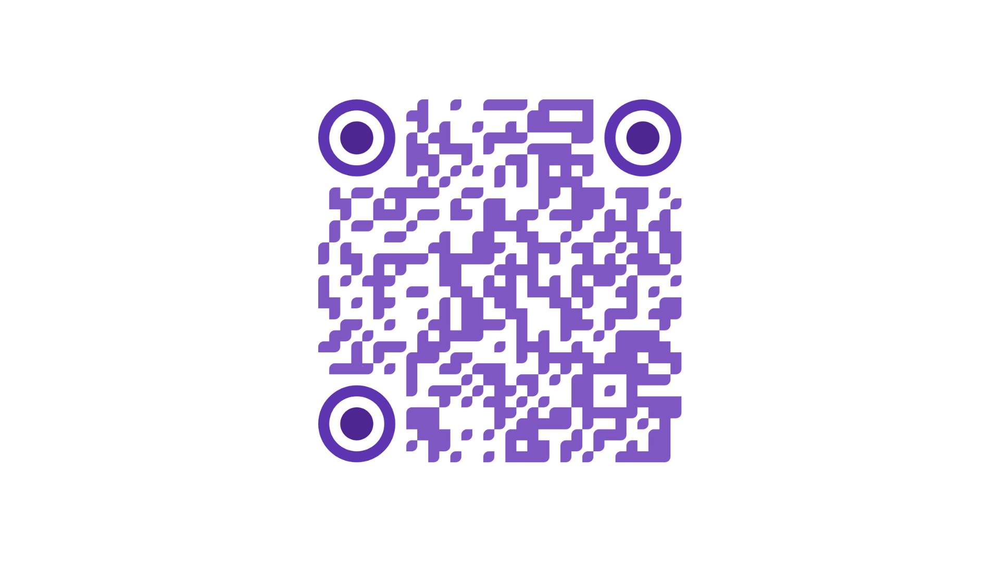

## Hello there

### I'm Sam  

Master’s Student in Interaction Design at CSUEB

I study interaction design with a focus on creating cohesive, user-centered experiences. My work blends design thinking, data, and creative coding to explore how people understand and interact with information, systems, and interfaces.

Through hands-on coding and prototyping, I use projects as a way to test ideas about interaction, feedback, accessibility, and meaning-making—not just how something looks, but how it behaves and feels to use.

For a more curated and visual portfolio, visit my personal website:  
[sampyle.com](https://sampyle.com)

---

### How My Projects Support My Growth as an Interaction Designer

Across these projects, I practice:
- Translating complex ideas and data into clear, intuitive interactions
- Designing systems that respond meaningfully to user input and behavior
- Iterating based on usability, clarity, and engagement
- Balancing aesthetic decisions with accessibility and function
- Collaborating across disciplines and communicating design intent through interactive media

---

### Featured Projects

---

### Data Visualization Project  
[View Project](https://sampyle01.github.io/P2---Data-Viz/)  

This project explores how data can be transformed into an interactive visual narrative. I focused on visual hierarchy, pacing, and user exploration to help users move through complex datasets without feeling overwhelmed.

By designing interactive elements that invite curiosity rather than demand attention, this project strengthened my ability to think about how users read, interpret, and question information—core skills in interaction design and information systems.

---

### Personality Planets (Group Project)  
[View Project](https://kimchampion.github.io/personality-planets/)  

Personality Planets is a metaphor-driven, narrative interaction that maps personality traits to planetary systems. Working collaboratively, I helped design user flows and interaction logic that guided users through the experience without explicit instruction.

This project emphasized the importance of conceptual metaphors, onboarding, and consistency in interactive systems, and reinforced how storytelling can support understanding and engagement in digital experiences.

---

### Rhythm Compass (Group Project)  
Use the QR code below to view on your device

  

Rhythm Compass is a mobile-focused experience designed to help users redirect habits and support mental well-being, particularly around depression. The project explores how rhythm, visual feedback, and gentle interaction cues can encourage reflection without feeling prescriptive or overwhelming.

Through this work, I explored emotional design, feedback loops, and user agency, learning how interaction design can influence behavior while remaining respectful and supportive of users’ mental states.

---

### Favorite Chips  
[View Project](https://sampyle01.github.io/InClass--Exercise-2/)  

This early data experiment focused on organizing and visualizing information using CSV files. While simple in scope, it was an important step in understanding data structures, categorization, and presentation choices.

The project helped me recognize how even playful datasets require thoughtful design decisions to remain readable, scalable, and user-friendly.

---

### Grad CAP (Group Project)  
[View Project](https://art-251.github.io/final/resource.html)  

Grad CAP is an early-stage prototype for a platform designed to help new and recent graduates find entry-level job opportunities. This project was part of a larger UX research and design process that included user research, wireframing, and visual design in Figma.

My contribution focused on translating wireframes into a functional prototype, reinforcing the relationship between UX planning and interaction implementation. The project highlighted how early prototypes can surface usability issues before full-scale development.

---

### Fruit Tap (Group Project)  
[View Project](https://editor.p5js.org/SamPyle01/sketches/dbAEPpyV4)  

Inspired by household games such as Tetris and Fruit Ninja, Fruit Tap is a physical-digital game that uses a Makey Makey controller and handmade physical fruit inputs. Players interact with tangible objects to control the game, blending physical play with digital feedback.

This project deepened my interest in physical computing and embodied interaction, demonstrating how non-traditional inputs can create playful, accessible, and memorable user experiences.

---

### What I’m Up To Right Now
- Working on my individual thesis project, to be presented in the fall  
- Learning Arduino and 3D modeling to expand into physical and spatial interaction  
- Exploring new ways to combine data, storytelling, and interactivity

---

### Get in Touch
- Email: SamPyle01@gmail.com  
- Website: [sampyle.com](https://sampyle.com)  
- LinkedIn: [linkedin.com/in/sampyle](https://www.linkedin.com/in/sampyle)  

---
